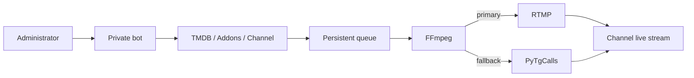

<div align="center">
  

  **Turn a Telegram channel into a bot-operated screening room.**

  [](https://github.com/SanNw/telegram-video-bridge/actions/workflows/ci.yml)
  [](docker-compose.yml)
  [](LICENSE)

  [🇧🇷 Português](README.md) · 🇺🇸 **English** · [🇪🇸 Español](README.es.md)
</div>

## 🎞️ The projection booth

Telerion joins a private control bot, a dedicated Telegram account and an FFmpeg pipeline. Operators select a movie; the system finds metadata and sources, prepares subtitles, manages the queue and broadcasts to the channel live stream.

> [!IMPORTANT]
> Stream only media you are authorized to store and broadcast. Telerion does not bypass DRM. Third-party addons run trusted Python code inside the authenticated process.

| Behind the scenes | On screen |
|---|---|
| 🎛️ Private admin controls | 📡 RTMP with PyTgCalls fallback |
| 🔎 TMDB catalog and addons | 🎬 720p H.264/AAC |
| 📚 Persistent queue | 💬 Portuguese subtitle automation |
| 🧲 Progressive qBittorrent downloads | 🧹 Automatic cleanup |

<details><summary><strong>▶ Show the architecture</strong></summary>


</details>

## 🍿 Quick premiere

```bash
git clone https://github.com/SanNw/telegram-video-bridge.git
cd telegram-video-bridge
cp .env.example .env
uv sync
uv run python -u scripts/generate_session.py
uv run python -m app.doctor
docker compose up -d --build
```

Required services: Docker Compose, a dedicated Telegram account, a BotFather bot, a live-enabled channel, MTProto credentials, TMDB and qBittorrent for torrent sources. See the [operations manual](docs/MANUAL.en.md) and the annotated `.env.example`.

## 🎛️ Controls

`/find`, `/canal`, `/play`, `/pause`, `/resume`, `/stop`, `/skip`, `/restart`, `/queue`, `/loop`, `/volume`, `/legenda`, `/subdelay`, `/status`.

## 🧩 Extend it

```bash
uv run python scripts/new_addon.py my_addon
```

Read the [addon contract](docs/ADDONS.en.md). Addons share the process and its Telegram credentials; install only reviewed code.

## 📚 Community

- [Contributing](CONTRIBUTING.md#english)
- [Security](SECURITY.md#english)
- [Code of Conduct](CODE_OF_CONDUCT.md#english)
- [Changelog](CHANGELOG.md)

<div align="center"><strong>A small projection booth for a shared screen.</strong></div>
