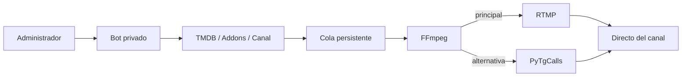

<div align="center">
  

  **Convierte un canal de Telegram en una sala de cine operada por bot.**

  [](https://github.com/SanNw/telegram-video-bridge/actions/workflows/ci.yml)
  [](docker-compose.yml)
  [](LICENSE)

  [🇧🇷 Português](README.md) · [🇺🇸 English](README.en.md) · 🇪🇸 **Español**
</div>

## 🎞️ La cabina de proyección

Telerion conecta un bot de control privado, una cuenta dedicada de Telegram y un pipeline FFmpeg. El operador elige la película; el sistema busca metadatos y fuentes, prepara subtítulos, administra la cola y transmite al directo del canal.

> [!IMPORTANT]
> Transmite únicamente medios que estés autorizado a almacenar y difundir. Telerion no evita DRM. Los addons de terceros ejecutan código Python de confianza dentro del proceso autenticado.

| En la cabina | En la pantalla |
|---|---|
| 🎛️ Control privado para administradores | 📡 RTMP con fallback PyTgCalls |
| 🔎 Catálogo TMDB y addons | 🎬 H.264/AAC a 720p |
| 📚 Cola persistente | 💬 Subtítulos en portugués automáticos |
| 🧲 Descarga progresiva con qBittorrent | 🧹 Limpieza automática |

<details><summary><strong>▶ Ver la arquitectura</strong></summary>


</details>

## 🍿 Estreno rápido

```bash
git clone https://github.com/SanNw/telegram-video-bridge.git
cd telegram-video-bridge
cp .env.example .env
uv sync
uv run python -u scripts/generate_session.py
uv run python -m app.doctor
docker compose up -d --build
```

Necesitas Docker Compose, una cuenta dedicada de Telegram, un bot de BotFather, un canal con directos, credenciales MTProto, TMDB y qBittorrent para torrents. Consulta el [manual operativo](docs/MANUAL.es.md) y `.env.example`.

## 🎛️ Controles

`/find`, `/canal`, `/play`, `/pause`, `/resume`, `/stop`, `/skip`, `/restart`, `/queue`, `/loop`, `/volume`, `/legenda`, `/subdelay`, `/status`.

## 🧩 Extensiones

```bash
uv run python scripts/new_addon.py mi_addon
```

Lee el [contrato de addons](docs/ADDONS.es.md). Los addons comparten el proceso y las credenciales de Telegram; instala solamente código revisado.

## 📚 Comunidad

- [Cómo contribuir](CONTRIBUTING.md#español)
- [Seguridad](SECURITY.md#español)
- [Código de conducta](CODE_OF_CONDUCT.md#español)
- [Historial de versiones](CHANGELOG.md)

<div align="center"><strong>Una pequeña cabina para una pantalla compartida.</strong></div>
