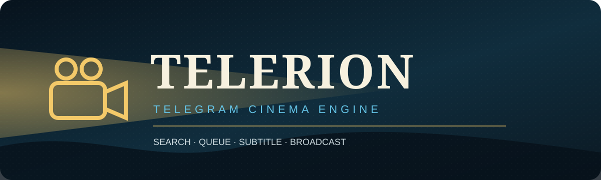
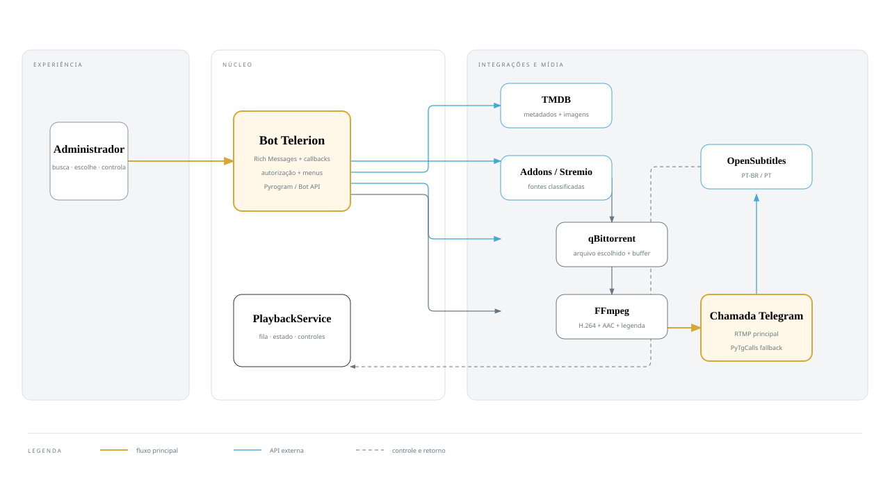
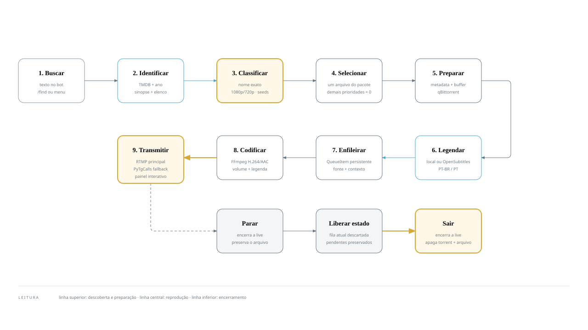

<div align="center">
  

  **Transforme um canal do Telegram em uma sala de cinema operada por bot.**

  [](https://github.com/SanNw/telegram-video-bridge/actions/workflows/ci.yml)
  [](https://www.python.org/)
  [](docker-compose.yml)
  [](LICENSE)

  🇧🇷 **Português** · [🇺🇸 English](README.en.md) · [🇪🇸 Español](README.es.md)
</div>

---

## 🎞️ A sessão começa aqui

Telerion conecta um bot privado, uma conta dedicada do Telegram e um pipeline FFmpeg. O operador escolhe o filme; o sistema pesquisa metadados e fontes, prepara legendas, organiza a fila e transmite para a live do canal.

> [!IMPORTANT]
> Use somente mídias que você tem autorização para armazenar e transmitir. O Telerion não contorna DRM e addons de terceiros executam código com acesso ao processo autenticado.

| Na cabine | Na tela |
|---|---|
| 🎛️ Controle privado por administradores | 📡 Live RTMP com fallback PyTgCalls |
| 🔎 Catálogo TMDB e addons | 🎬 H.264/AAC em 720p |
| 📚 Fila persistente e controles | 💬 Legendas PT-BR com ajuste de sincronia |
| 🧲 Download progressivo via qBittorrent | 🧹 Liberação e limpeza automática |

### Entenda o projeto visualmente

#### Arquitetura geral

<a href="docs/architecture.html">
  
</a>

Componentes, responsabilidades e integrações. [Abra a versão editorial completa](docs/architecture.html).

#### Fluxo completo de reprodução

<a href="docs/playback-flow.html">
  
</a>

Da busca ao encerramento e à limpeza do arquivo. [Abra a versão editorial completa](docs/playback-flow.html).

## 🍿 Estreia rápida

**Você precisa de:** Docker Compose, uma conta Telegram dedicada, um bot do BotFather, um canal com live, credenciais MTProto, token TMDB e qBittorrent para torrents.

```bash
git clone https://github.com/SanNw/telegram-video-bridge.git
cd telegram-video-bridge
cp .env.example .env
uv sync
uv run python -u scripts/generate_session.py
uv run python -m app.doctor
docker compose up -d --build
```

<details>
<summary><strong>🔐 Variáveis obrigatórias</strong></summary>

```dotenv
API_ID=
API_HASH=
SESSION_STRING=
CHAT_ID=
STREAM_CHAT_ID=
OWNER_USER_ID=
BOT_TOKEN=
TMDB_API_KEY=
OPENSUBTITLES_API_KEY=
OPENSUBTITLES_USERNAME=
OPENSUBTITLES_PASSWORD=
OPENSUBTITLES_USER_AGENT=Telerion v1

MEDIA_HOST_PATH=./media/torrents
QBITTORRENT_HOST=host.docker.internal
QBITTORRENT_PORT=8080
QBITTORRENT_USERNAME=admin
QBITTORRENT_PASSWORD=
QBITTORRENT_SAVE_PATH=E:/Backup/Filmes
QBITTORRENT_LOCAL_PATH=/app/media/torrents
```

`MEDIA_HOST_PATH` é o diretório do host montado no container. `QBITTORRENT_SAVE_PATH` é o caminho visto pelo qBittorrent; `QBITTORRENT_LOCAL_PATH` é o mesmo conteúdo visto pelo Telerion.

</details>

## 🎛️ Comandos da cabine

| Descoberta | Reprodução | Sessão |
|---|---|---|
| `/find <filme>` | `/play <fonte>` | `/status` |
| `/canal <filme>` | `/pause` · `/resume` | `/queue` · `/clear` |
| `/addons` | `/stop` · `/skip` · `/restart` | `/loop off\|item\|queue` |
| `/pick <n>` | `/volume <0-200>` | `/legenda` · `/subdelay` |

## 🧭 Mapa do projeto

```text
app/bot/          comandos, autorização e respostas
app/services/     orquestração dos casos de uso
app/player/       fila, estado e persistência
app/streaming/    FFmpeg e supervisão de processos
app/telegram/     MTProto, RTMP e PyTgCalls
app/addon_system/ contrato e ciclo de vida dos addons
addons/           fontes de mídia instaladas
```

## 🧩 Crie uma nova fonte

```bash
uv run python scripts/new_addon.py meu_addon
```

Leia o [contrato de addons](docs/ADDONS.md) antes de distribuir código. Addons são confiáveis por definição e rodam no mesmo processo da sessão Telegram.

## 🧪 Qualidade antes da sessão

```bash
uv sync --all-groups
uv run ruff check .
uv run black --check .
uv run mypy
uv run pytest
docker build -f docker/Dockerfile -t telerion:local .
```

## 📚 Próximos rolos

- [Manual operacional completo](docs/MANUAL.md)
- [Como contribuir](CONTRIBUTING.md)
- [Política de segurança](SECURITY.md)
- [Código de conduta](CODE_OF_CONDUCT.md)
- [Histórico de versões](CHANGELOG.md)

---

## Painel de reproducao e legendas

Ao escolher uma fonte, a própria Rich Message vira o painel de reprodução. Pausa, retomada, stop, skip, reinício, volume, fila e legendas atualizam essa mesma mensagem, sem criar respostas sucessivas no chat. **Parar** encerra a live e preserva o arquivo; **Sair** encerra a live e remove do qBittorrent o torrent atual com seus arquivos.

O submenu permite ligar ou desligar a faixa, ajustar a sincronia e escolher arquivos `.srt` diretamente em `QBITTORRENT_LOCAL_PATH/.subtitles`. Com `OPENSUBTITLES_API_KEY`, `OPENSUBTITLES_USERNAME` e `OPENSUBTITLES_PASSWORD`, tambem busca alternativas PT-BR/PT na API oficial. Downloads sao limitados a 2 MB. Os comandos `/legenda` e `/subdelay` continuam disponiveis como fallback.

<div align="center">
  <strong>Telerion</strong><br>
  Uma cabine pequena para uma tela compartilhada.<br><br>
  Distribuído sob a <a href="LICENSE">licença MIT</a>.
</div>
